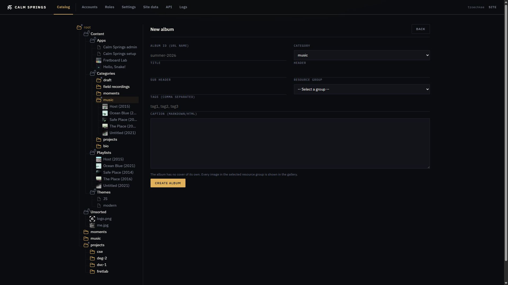

# Albums

An album is a gallery: pick a folder of pictures, and the public site shows them. Captions travel with the files. The album has no cover of its own — every image in the selected resource group is the gallery.

Albums sit next to [pages](pages.md) under a [category](categories.md). Tiles are tagged **ALBUM**.

## New album

Right-click a category → **New album**. (The gold **+** on the category pane is **New page**, not an album.)

| Field | What it does |
| --- | --- |
| **Album ID (URL name)** | Public path. Required. |
| **Category** | Homepage section. |
| **Title** / **Header** / **Sub Header** | Same idea as a page. |
| **Resource group** | Required. The media folder whose images become the gallery. |
| **Tags** | Comma-separated. |
| **Caption (Markdown/HTML)** | Text with the gallery. Same embed tags as a [page](pages.md) body. Link to this album with `<cse-page id="album-url-name">`. |

**Create album** publishes the gallery. Put photos in the folder first (see [Files](files.md)); an empty group makes an empty album.

## After create

The album appears under the category in the tree. **Edit** from the tile or the tree opens the same fields so you can point it at a different folder or change copy.

**Rename** and **Delete** work like pages. Deleting the album does not delete the photos in the resource group.
