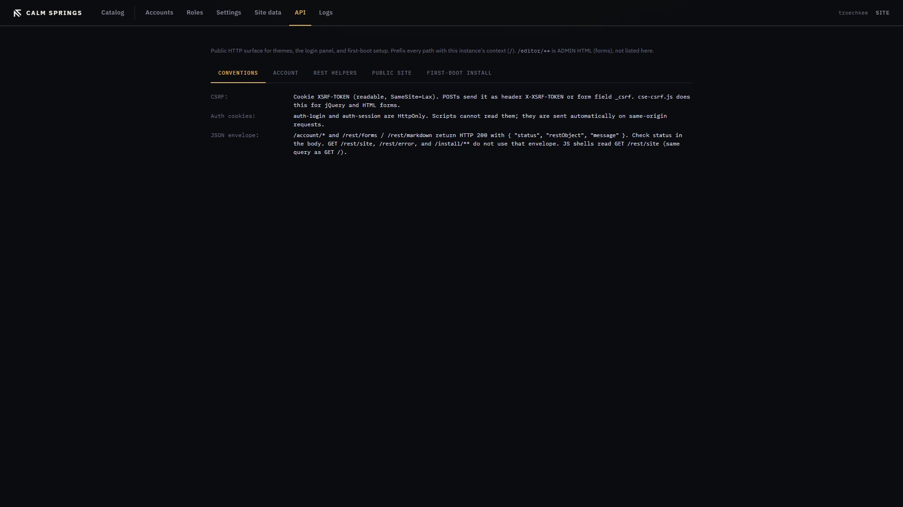

# API

**API** documents the public HTTP surface for themes, the login panel, and first-boot setup. It is a reference, not a second admin.

Prefix every path with this instance’s context (`/` on a root install, or the context path if the engine is mounted under one). `/editor/**` is Admin HTML (forms) and is **not** listed here.

## Tabs

- **Conventions** — cookies, CSRF, JSON envelope
- **Account** — login panel JSON
- **REST helpers** — forms and markdown helpers themes call
- **Public site** — HTML, media, `GET /rest/site` for JS shells
- **First-boot install** — JSON while the installer is open (these routes 404 after Finish)

Each endpoint row expands: method, path, who may call it, whether CSRF is required, and a short summary.

## Conventions worth reading first

**CSRF.** Cookie `XSRF-TOKEN` (readable, SameSite=Lax). POSTs send it as header `X-XSRF-TOKEN` or form field `_csrf`. `cse-csrf.js` does this for jQuery and HTML forms.

**Auth cookies.** `auth-login` and `auth-session` are HttpOnly. Scripts cannot read them; they are sent automatically on same-origin requests.

**JSON envelope.** `/account/*` and most `/rest` POSTs return HTTP 200 with `{ "status", "restObject", "message" }`. Read `status` in the body. `GET /rest/site`, `/rest/error`, and `/install/**` do not use that envelope. First-boot install uses real HTTP status codes (404, 400, 409, 429).
