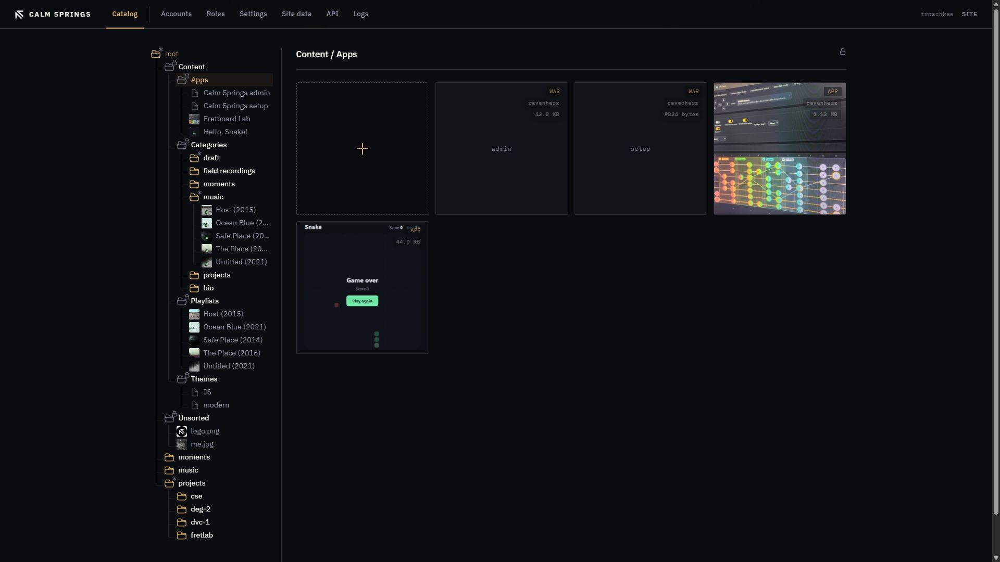

# Apps

Apps are self-contained pieces that sit beside the rest of the site — experiments, tools, extras — without a second hosting story.

## Open Apps

**Content → Apps**. Each tile is a product: logo when the pack ships one, otherwise the name.

Tags:

- **WAR** — bundled with the engine (admin, setup). You do not remove these.
- **APP** — an installed `.cseapp` pack.
- Size and company, when the pack declares them.

**i** shows id, public URL, and file name. The link icon opens the public URL in a new tab.

## Install a pack

The gold **+** accepts a `.cseapp` file. Click or drop. After install, the new tile appears in this pane (and in the tree). If the pack includes a product logo, the tile uses it.

## Bundled vs installed

**Calm Springs admin** and **Calm Springs setup** are the desk and the first-boot installer. Leave them. Installed packs can be removed with **×** when the tile allows it — confirmation first.

Apps do not replace [themes](themes.md). A theme is the public skin; an app is an extra product on the same instance.
