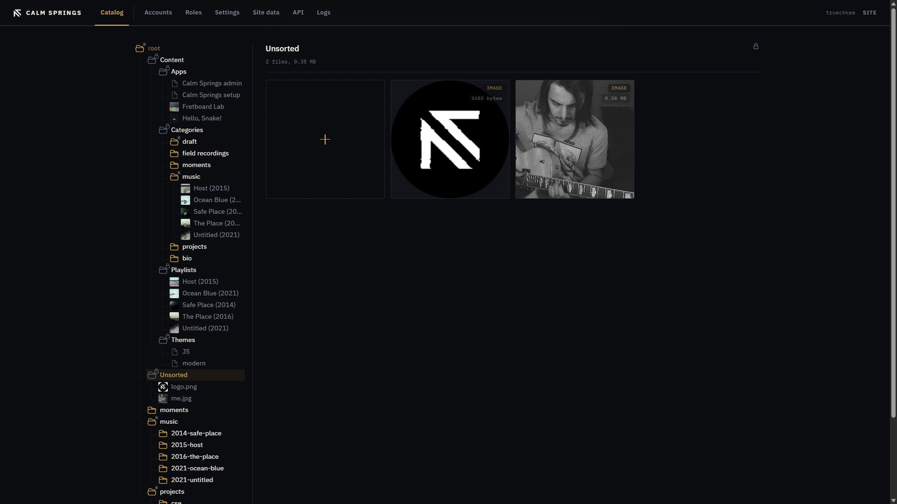

# Catalog

Catalog is one tree for everything the site publishes: writing, galleries, music, files, small apps, and skins. Create and edit in the same desk. The public site stays the public site.

## Layout

**Left:** the tree, starting at **root**. Click a row to open it in the pane. The gold highlight is the current group.

**Right:** the working pane for that group — tiles, an upload `+`, or an editor form. **Back** returns from a form to the last pane.

The top bar stays in view. **Catalog** is underlined while you are in the tree.

## The Content branch

Under **Content** the tree is grouped by kind:

- **Apps** — installed applications
- **Categories** — homepage sections, with pages and albums under each category
- **Playlists** — listening lists
- **Themes** — public skins
- **URL Templates** — patterns for `<cse-url>` embeds

These rows are the catalog, not ordinary media folders. You do not upload photos here; you open tiles, create items, or install packs. The Content headings themselves are locked: you work in their tiles, you do not rename those folders.

## Unsorted and media folders

Below Content, **root** also holds **Unsorted** and any media folders you created (for example `music`, `projects`, `moments`). Those folders are for files. See [Files](files.md).

**Unsorted** is locked (padlock on the pane). You can upload into it. You cannot rename, delete, or drag the group itself.

## Right-click menu

Right-click a tree row or a tile for the actions that apply. The browser menu is suppressed; this is the Catalog menu.

On a **category** the menu typically includes **Edit**, **New page**, **New album**, **Rename**, and **Delete**.

Other rows show a subset of:

- **Edit** / **Open** — forms or the public URL
- **New page** / **New album** — under a category
- **New group** — a nested media folder
- **New category** — under Categories
- **Rename**
- **Download** — a file
- **Activate** — a theme that is not already on
- **Delete**

Delete asks for confirmation. It is permanent. Do not delete live sections unless you mean to.

## Rename

**Rename** turns the row into a field. Enter the name and press Enter. Categories, pages, albums, playlists, URL templates, and media folders can be renamed this way when the row allows it.

## Drag and drop

Drag a file or a movable folder onto another folder in the tree or onto the pane. Drop targets that cannot accept the item ignore the drop. On a playlist form, drop MP3s (or a folder of them) onto the track list.

Locked groups (Unsorted) and the Content headings do not move. Themes that shipped in the engine are not dragged; installed packs can be reordered on the Themes pane.

## Tiles

Tiles in the pane match the tree. Hover **i** for details. **×** deletes when the item allows it. The gold **+** creates or uploads, depending on the pane.
