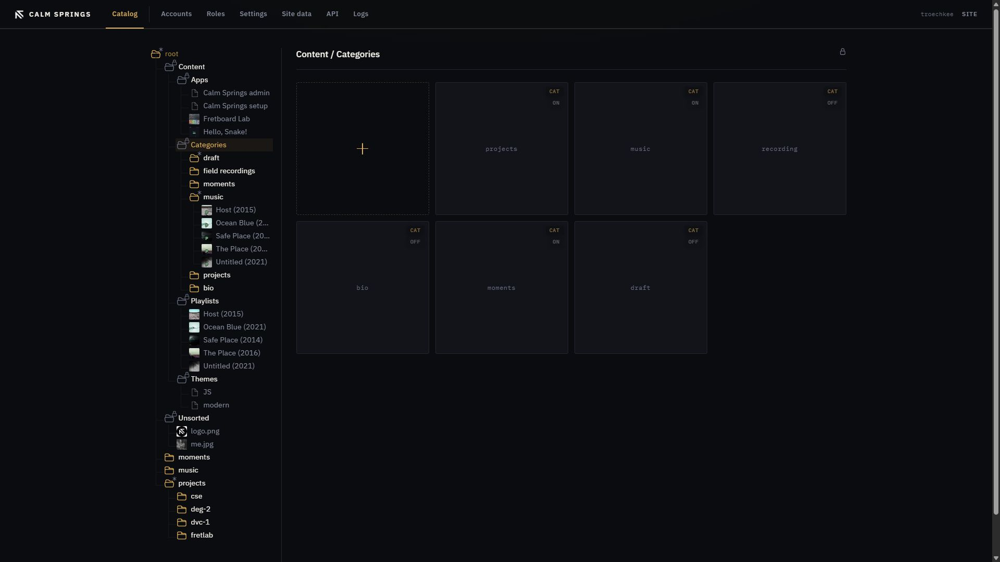
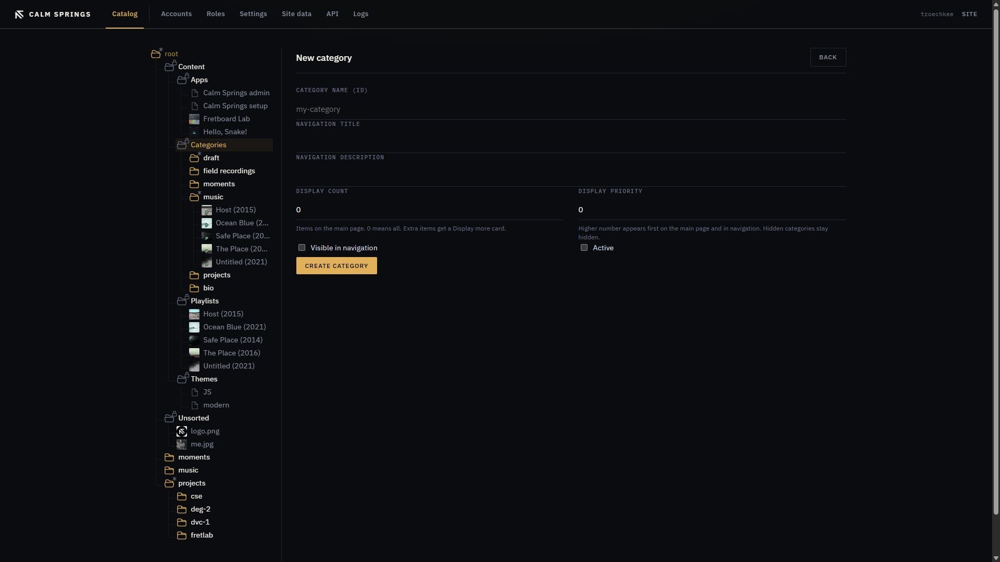
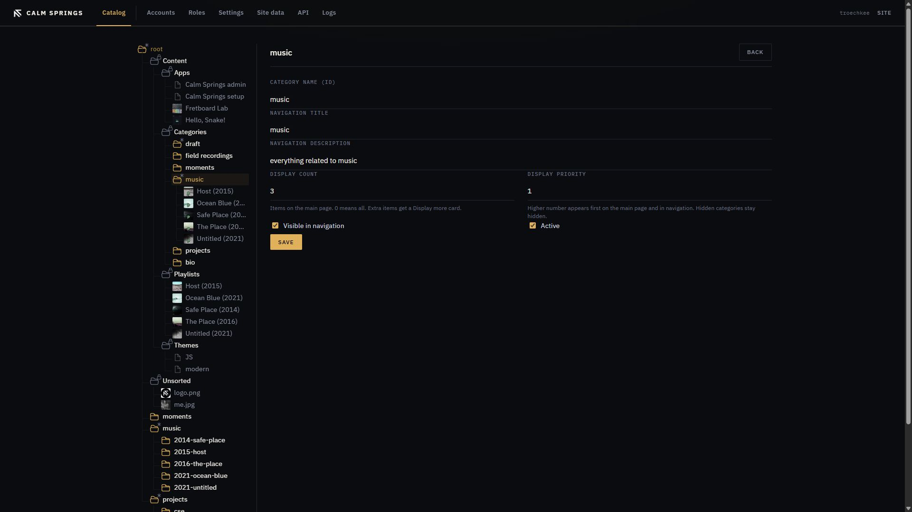

git i# Categories

Categories are the sections on the homepage: nav labels, how many items show on the first screen, and whether the section is live. Pages and albums hang under a category in the tree.

## Open Categories

In Catalog, open **Content → Categories**. Tiles are tagged **CAT** and **ON** or **OFF**. **ON** means the category is active. Click a tile (or the tree row) to see its pages.

The gold **+** opens **New category**.

## New category

| Field | What it does |
| --- | --- |
| **Category Name (ID)** | Stable id used in the tree and in addresses. Required. |
| **Navigation Title** | Label in the public nav. |
| **Navigation Description** | Line under the section on the homepage. |
| **Display count** | How many items on the main page. `0` means all. Extra items get a **Display more** card. |
| **Display priority** | Higher number appears first on the main page and in navigation. Hidden categories stay hidden. |
| **Visible in navigation** | Show in the public nav. |
| **Active** | Include the section on the site. |

**Create category** saves and returns you to Catalog.

## Edit

Right-click the category in the tree → **Edit**, or use **Edit** from the tile details. Same fields as create, then **Save**.

**Rename** in the tree menu changes the display name without opening the form.

## Pages under a category

Right-click the category → **New page** or **New album**, or open the category pane and use **+**. See [Pages](pages.md) and [Albums](albums.md).

## Delete

**Delete** on the menu or **×** on the tile removes the category **and all its pages**. Confirmation first. That does not delete media folders with the same name; those are separate [Files](files.md) groups.
