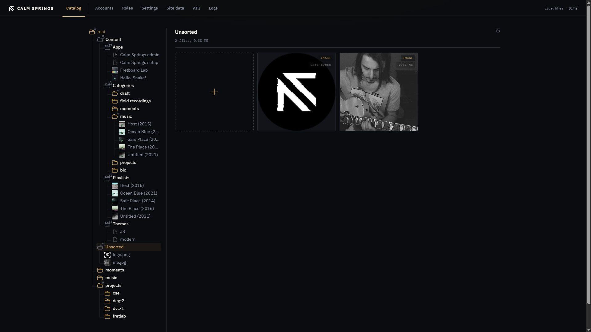
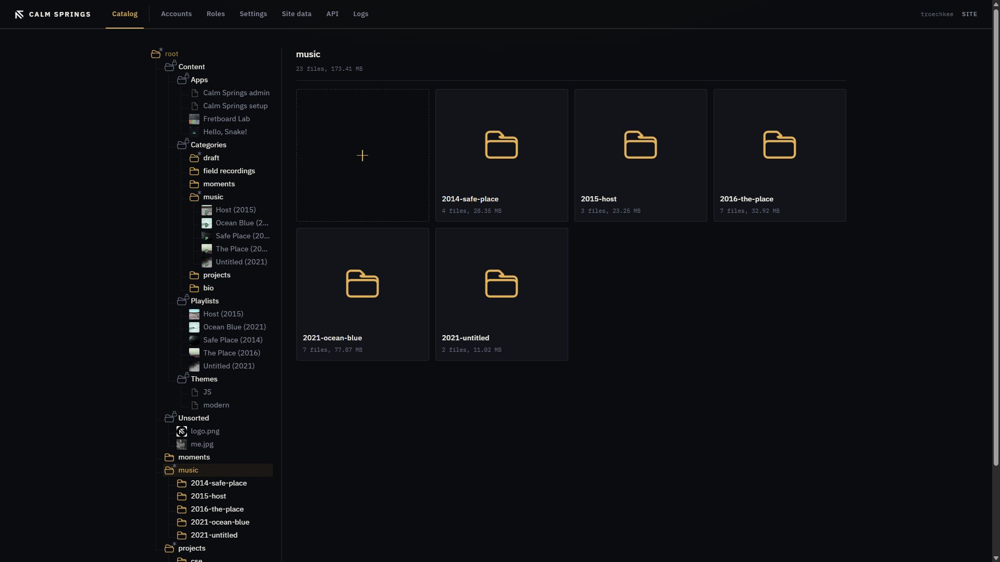

# Files

Media lives in folders under **root**, beside the Content branch. Folders nest the way a studio files things. Photos, MP3s, videos, and PDFs in those folders are what albums, pages, and playlists draw from.

## Unsorted

**Unsorted** is the catch-all. It is locked: you can add files, you cannot rename or delete the group. Use it as a landing pad, then drag files into a real folder.

The pane title shows a padlock, a file count, and a size.

## Folders

Right-click a folder that can have children and choose **New group**. Name it, then open it. Nested folders show a gold folder glyph, the name, and a summary (`N files, size`).

Click a subfolder tile or a tree row to open it. **×** on a folder tile deletes that group and everything inside it — confirmation first.

## Upload

The gold **+** tile accepts:

- Images: `.jpg`, `.jpeg`, `.png`, `.heic`, `.heif`
- Audio: `.mp3`
- Video: `.mp4`, `.mov`, `.m4v`, `.webm`, `.mkv`
- PDF: `.pdf`

Click **+** or drop a file on it. A progress bar runs on the tile while the file is stored. HEIC from an iPhone is accepted; the engine makes a web preview so the public site stays light. A PDF stores a JPEG of the first page. Drag it into a page as `<cse-binary>`.

## Tiles

Each file tile shows a thumbnail (or a type fallback), a type tag (`IMAGE`, and so on), and a size. **↓** downloads. **i** opens details (path, metadata). **×** deletes the file.

Right-click a file in the tree for **Download**, **Rename**, and **Delete** when those actions apply.

## Where files show up

- **Albums** show every image in a chosen resource group. See [Albums](albums.md).
- **Pages** can pick a featured image from uploaded pictures, and embed a PDF with `<cse-binary>`. See [Pages](pages.md).
- **Playlists** take MP3s dragged from the Catalog tree. See [Playlists](playlists.md).

Upload into the folder you will actually use. Unsorted works, but a named folder keeps the tree honest.
