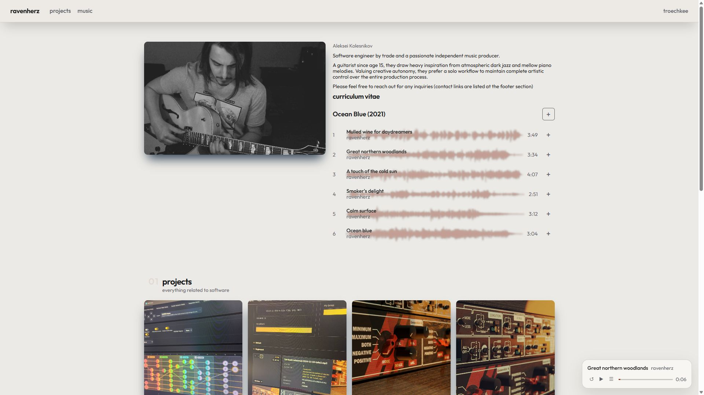

# Admin console

The admin console is the desk behind the public site. **Catalog** holds writing, galleries, music, files, small apps, and skins. The other tabs are for people, settings, the site archive, the public HTTP surface, and logs.

Only **Admin** and **Owner** accounts can open it.

## Open the console

1. Open the public site.
2. Sign in from the account control (your login name, or the guest account panel on the page).
3. Choose **Admin console**.

When you are already signed in as an operator, the account control lists **Admin console** and **Logout**.

**Site** in the console (top right) returns you to the public homepage. Your login is shown next to it.

## The desk

The console always shows the same top bar:

- **Catalog** — the tree and the working pane
- **Accounts** — who can sign in
- **Roles** — who may use the editor, and ownership
- **Settings** — site copy, the live theme, image upload, your personal theme
- **Site data** — export and import a `.csesite` archive
- **API** — public HTTP surface for themes and login
- **Logs** — live tail of the engine log

Catalog is the home. The first open lands on **Unsorted** when that is the default group.

## This guide

- [Catalog](catalog.md) — tree, menus, rename, drag
- [Files](files.md) — folders, upload, Unsorted
- [Categories](categories.md) — sections on the homepage
- [Pages](pages.md) — stories with a stable address
- [Albums](albums.md) — galleries from a folder of pictures
- [Playlists](playlists.md) — site-owned listening lists
- [Apps](apps.md) — bundled WARs and `.cseapp` packs
- [Themes](themes.md) — skins, Activate, `.csetheme` packs
- [Accounts](accounts.md) — the people list
- [Roles](roles.md) — access matrix and owner transfer
- [Settings](settings.md) — database overlay and your theme
- [Site data](site-data.md) — take the archive with you
- [API](api.md) — conventions and endpoint tabs
- [Logs](logs.md) — wrap, auto-tail, download
