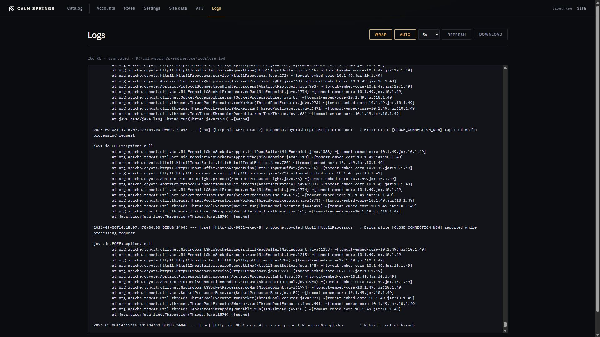

# Logs

**Logs** is a live tail of the engine log file. Use it when the public site or Catalog misbehaves and you need the last lines from the process.

## Toolbar

- **Wrap** — wrap long lines in the view (pressed = on)
- **Auto** — poll for new lines
- **Interval** — 2s, 5s, 10s, 30s, or 60s while Auto is on
- **Refresh** — fetch once
- **Download** — the full file, not only the window on screen

Wrap, Auto, and the interval are remembered in this browser.

## The view

The line under the title is the window size, whether the view is **truncated**, and the path on disk. The engine shows a tail (for example 256 KB). Older lines are in the downloaded file.

The pane is a `pre` of recent output: timestamps, level, thread, logger, message. It is the same log the process writes; it is not a second filtered stream.

If no file is found, the page lists the paths it tried.
