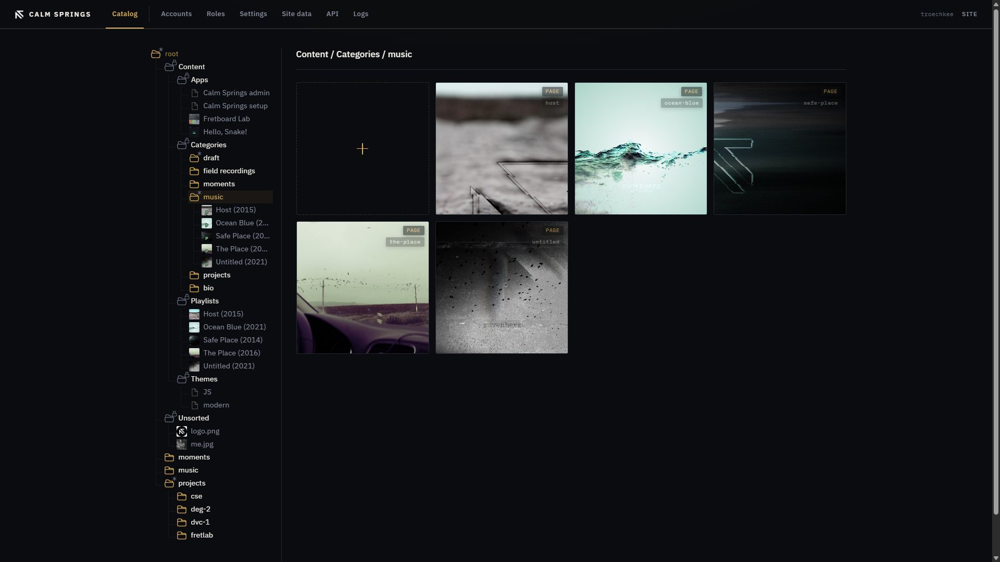
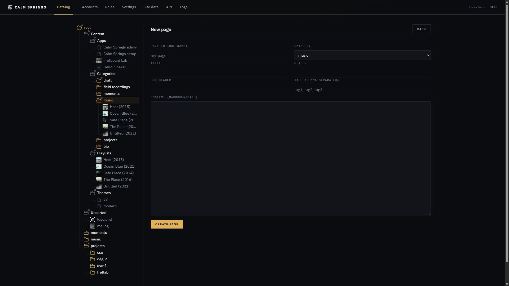
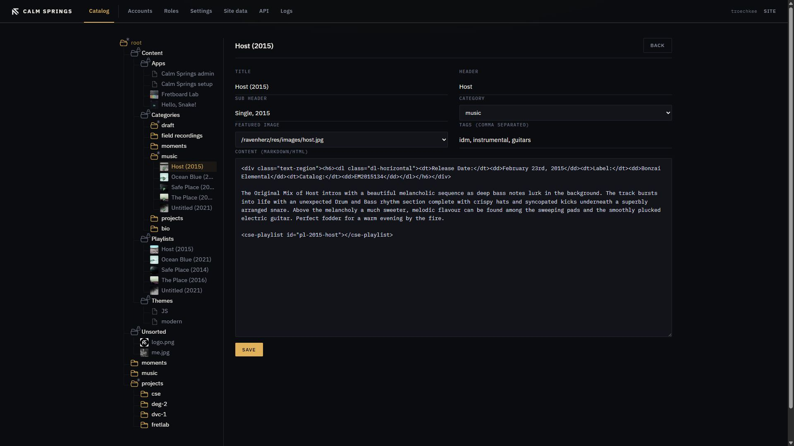

# Pages

A page is a story with a stable address — title, cover, tags, and a body in Markdown or HTML. Pages live under a [category](categories.md) in **Content → Categories**.



## Open a category’s pages

In the tree, expand **Content → Categories** and click the category. The pane lists page tiles tagged **PAGE** (and **ALBUM** for galleries). Each tile shows a cover when the page has a featured image, plus the URL name.

**+** opens **New page** with that category already selected. Right-click the category → **New page** does the same.

## New page



| Field | What it does |
| --- | --- |
| **Page ID (URL name)** | The public path. Required. Use lowercase letters, numbers, and hyphens. |
| **Category** | Homepage section. You can leave it empty, but the page then stays off the section lists. |
| **Title** | Main title. |
| **Header** / **Sub Header** | Lines the theme may show above or beside the body. |
| **Tags** | Comma-separated. |
| **Content (Markdown/HTML)** | The body. Markdown for speed; HTML when you need control. |

**Create page** writes the page and returns to Catalog.

The body can leave custom tags. They stay as tags in Mongo and expand when the public page renders. Drag a page, category, app, playlist, or image from the Catalog tree into the textarea, or paste:

```html
<cse-playlist id="your-playlist-id"></cse-playlist>
<cse-image id="resource-object-id"></cse-image>
<cse-page id="page-or-album-url-name"></cse-page>
<cse-category id="category-name"></cse-category>
<cse-app id="app-slug"></cse-app>
```

`cse-image` is a full-width picture (`id` is the resource ObjectId, or the public path). The other three cards share one layout: preview on the left, title and details on the right. Albums use `cse-page` and link to `/?album=`. See [Playlists](playlists.md), [Categories](categories.md), and [Apps](apps.md).

## Edit

Click the tile, or right-click → **Edit**. The URL name does not change on this form; **Rename** in the tree changes the title shown in Catalog.



Editing adds **Featured Image**: pick an uploaded picture, or none. The rest of the fields match create. **Save** updates the live page.

## Delete

**×** on the tile or **Delete** in the menu removes the page. Confirmation first. The featured image file stays in its media folder.
