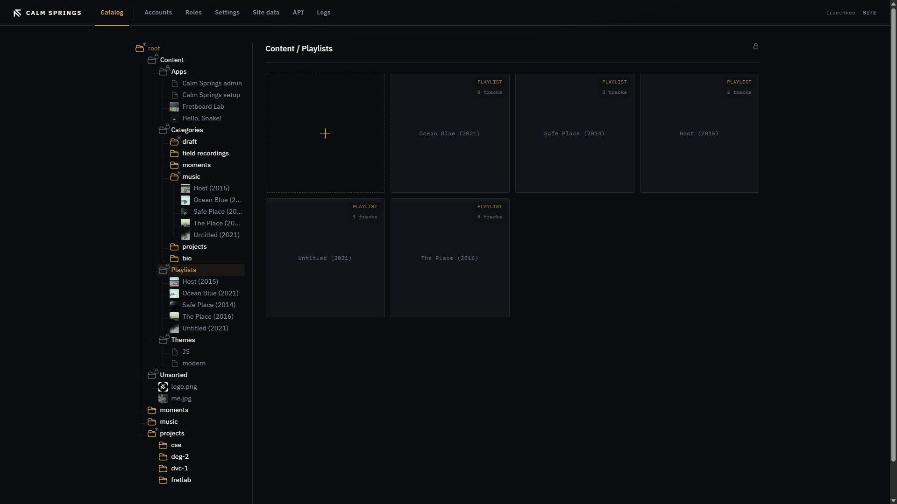
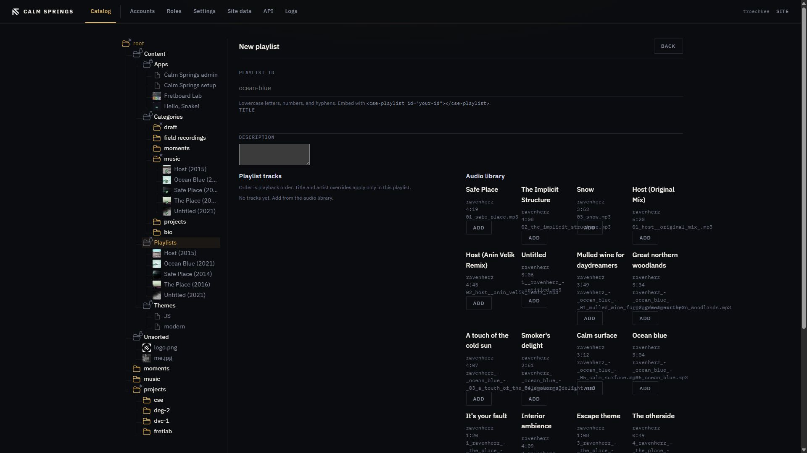

# Playlists

A playlist is music that belongs on the site. Build it once. Embed it in any page. The player is part of the house, not a widget rented from somewhere else.



## Open Playlists

**Content → Playlists**. Tiles are tagged **PLAYLIST**. **+** opens **New playlist**.

Upload MP3s in [Files](files.md) before you expect tracks in the audio library.

## New playlist



| Field | What it does |
| --- | --- |
| **Playlist id** | Lowercase letters, numbers, and hyphens. This is what you embed. |
| **Title** | Name on the public site. |
| **Description** | Optional copy. |

**Playlist tracks** is playback order. Add from **Audio library** on the right. **Up** / **Down** reorder. **Remove** drops a track from this list only — the MP3 stays in Catalog.

**Title override** and **Artist override** apply only in this playlist. File tags remain on the recording.

If the library is empty, the hint says to upload MP3s in Catalog first. If every uploaded track is already on the list, the library says so.

**Create playlist** saves the list.

## Embed

In a [page](pages.md) body:

```html
<cse-playlist id="your-id"></cse-playlist>
```

Use the same id you entered on the form. You can also drag the playlist from the Catalog tree into the page textarea.

## Edit and delete

Open a playlist by clicking its tile (that opens the same editor as create). **×** removes the playlist, not the audio files.
