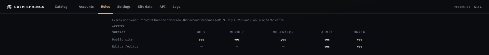

# Roles

**Roles** is who may use the public site, who may open Catalog, and who may use each installed app. There is exactly one owner. Transfer it from a circle on [Accounts](accounts.md); that account becomes **Admin**. Opening Catalog is the **Open Catalog** checkbox (`editor.access`), not a fixed rank.

## Access

The grid on this page **is** the live rule set. Surfaces are split into tabs. Each tab is its own table: a row is one grant, a column is a role. A checked cell grants that surface to that role.

| Tab | What it covers |
| --- | --- |
| Account | Sign in, register, activate, sign out, edit own profile |
| Apps | Installed apps (`app:{slug}`), including Login, Setup, and Admin |
| Content Defaults | Read / edit / delete when a page, file, or folder **inherits** and no parent Access rule applies |
| Editor | Open Catalog and each Catalog tab (pages, files, roles, settings, …) |
| Install | First-boot installer endpoints |
| Site | Public home page, site JSON, protected media URLs |

Rows on a tab are **A–Z** by the label you see. A circled **?** next to a name explains what that grant actually does (hover).

**Save access** writes **every** tab, not only the one you are looking at. Switching tabs does not drop unsaved checks; they stay in the same form.

| Surface | Guest | Other roles | Owner |
| --- | --- | --- | --- |
| Public site, sign-in, apps marked guest-safe | checkbox | checkbox | always |
| Catalog (`editor.access`) and other editor rows | — | checkbox | always |
| Installed apps (`app:{slug}`) | only if guest-safe | checkbox | always |

Guest is people who are not signed in. Guest cells exist only on rows marked guest-safe. Owner’s column is locked on.

Roles other than Guest and Owner are yours to create, rename, archive, or delete. **Can sign in** is a flag on the role. Inactive stays non-loginable unless you change it.

Do **not** delete Guest or Owner (the server refuses). Do **not** delete the seeded ladder (Member, Admin, …) expecting them to stay gone: `ensureSeeded()` recreates missing seed slugs with a new id. Archive hides a role from this grid and from Access pickers. Delete does not rewrite `roleIds` on pages, files, or folders; leftover ids just match nobody.

Assign a person a role, or transfer ownership, on [Accounts](accounts.md). Click a circle.

## After a change

**Save access** writes the grid. Assigning a role on Accounts writes that person’s role. Anyone without **Open Catalog** is signed out of the editor on the next request.

## Engine notes

Tab order and A–Z sort live in `RoleMatrixView`. Hints are `CapabilityRecord.hint`, filled in `CapabilityCatalog` (engine rows) and `CapabilityRecord.app` (installed apps). The Roles template is `app-admin/src/admin/editor-roles.html`; the running editor reads the exploded admin pack under the instance disk (`content-cache/apps/admin/`), not the WAR.
