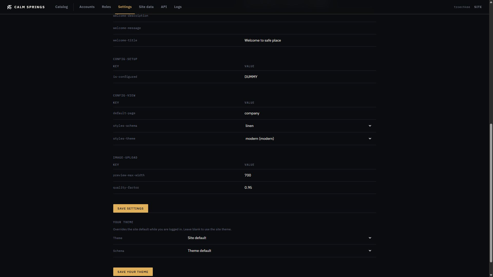

# Settings

**Settings** is the live overlay: values stored in the database, used instead of the JSON shipped in the engine after a redeploy. Change copy and the public skin here without waiting on a vendor.

The page is grouped by context (build info, personal/company copy, setup, view, image upload). Each row is a **Key** and a **Value**.

## Site theme

Under **config-view**:

- **default-page** — which page the homepage treats as the default piece
- **styles-schema** — color room for the live theme (linen, midnight, and the others the theme ships)
- **styles-theme** — which [theme](themes.md) is the site default (same choice as **Activate** in Catalog, as a dropdown)

**Save settings** writes every context on the form.

## Image upload

**preview-max-width** and **quality-factor** control how large previews are made from uploaded pictures. Lower width keeps the public site light; quality is a 0–1 JPEG factor.

## Copy and company

**config-personal** holds builder link, company name, address, email, social handles, copyright lines, and welcome title. These strings show on the public site in the places the active theme uses them.

**config-build-info** is version labels (branch, product, version). Treat them as display, not as a release switch.

**is-configured** under **config-setup** is the first-boot flag. Do not clear it on a running site.
