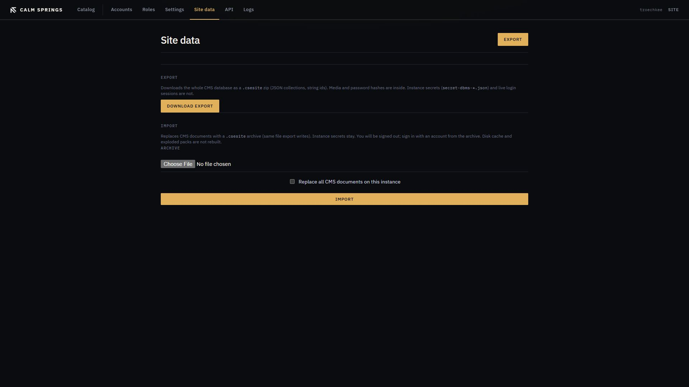

# Site data

**Site data** is how you take the archive with you, and how you replace this instance with an archive you already have.

## Export

**Export** / **Download export** downloads the whole CMS database as a `.csesite` zip (JSON collections, string ids). Media and password hashes are inside. Instance secrets (`secret-dbms-*.json`) and live login sessions are not.

Keep the file somewhere you control. It is the site.

## Import

Import **replaces** CMS documents with a `.csesite` archive (the same file export writes). Instance secrets stay. You will be signed out; sign in with an account **from the archive**. Disk cache and exploded packs are not rebuilt.

Steps:

1. Choose the `.csesite` file.
2. Check **Replace all CMS documents on this instance** (required).
3. **Import**.

This is not a merge. Everything currently in the CMS on this instance goes away. Do not import onto a live site unless that is the point.

If the database is not connected, the page tells you to connect it before export or import.
