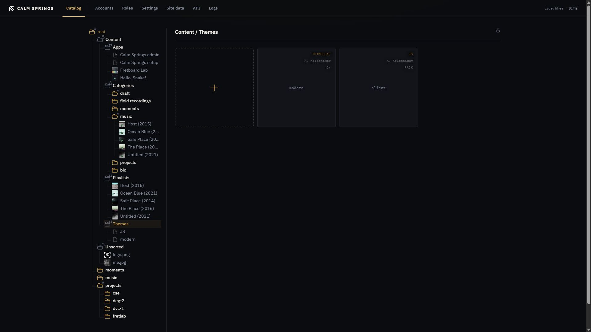

# Themes

A theme is the public skin. Switch the skin; the archive stays. Catalog is where you install packs and choose which one is live.

## Open Themes

**Content → Themes**. Tiles show a preview when the pack includes `preview.jpg`, otherwise the theme id.

Tags on the tile:

- **Shell kind** — for example `THYMELEAF` or `JS`
- **Author**, when declared
- **ON** — this is the live public theme
- **PACK** — installed `.csetheme`
- **WAR** — shipped in the engine, not a pack you uploaded

**i** lists id, author, shell, default color room (schema), schemas, original file, and size.

## Activate

Only one theme is **ON**. On a tile that is not live, **Activate** (on the details panel or right-click **Activate** in the tree) makes it the public skin. The previous **ON** tile becomes **PACK** or **WAR**.

The public homepage follows this choice for everyone.

## Install a pack

The gold **+** accepts a `.csetheme` file. Click or drop. After install, the new tile appears. Drag installed packs to reorder them on this pane (bundled themes stay put).

## Remove

**×** / **Remove** deletes an installed pack from the database and disk. You cannot remove the active theme or a bundled **WAR** theme. Activate something else first, then remove the pack.

## Color rooms

A theme may ship several schemas (color rooms). The site default schema is **styles-schema** on [Settings](settings.md). Changing the theme and changing the schema are separate: activate the skin here, pick the room in Settings.
